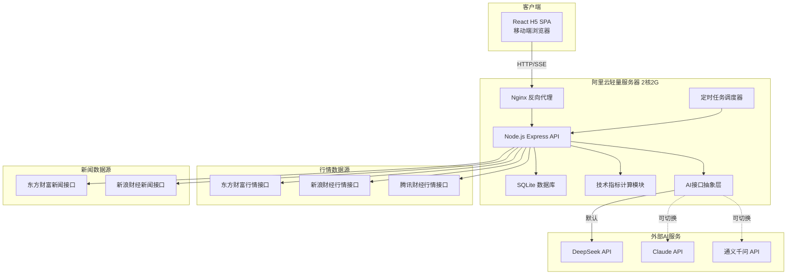
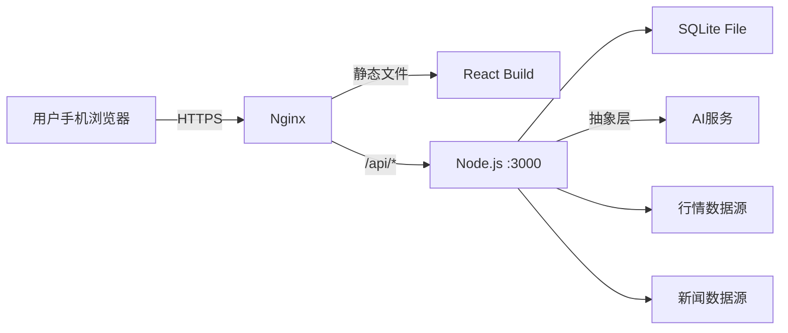
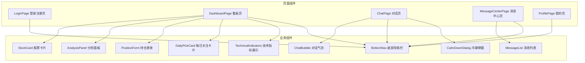
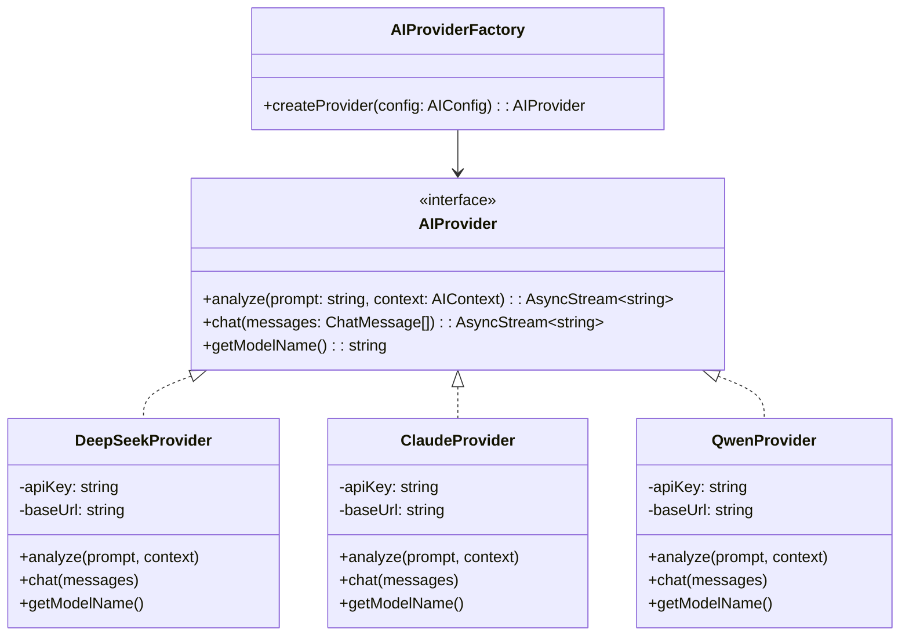
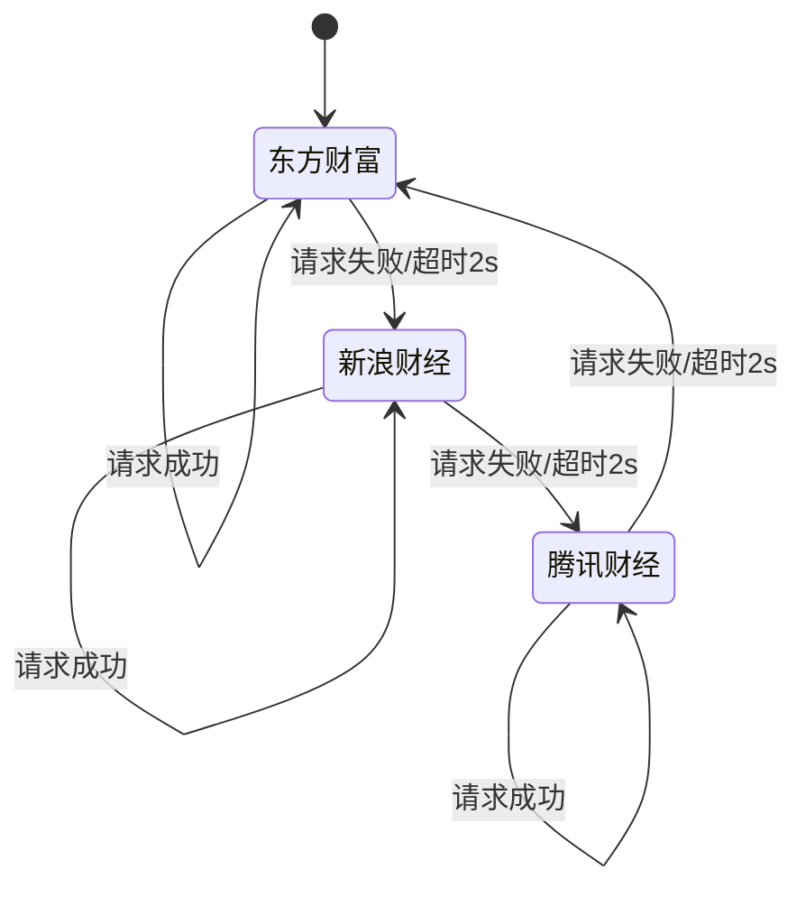
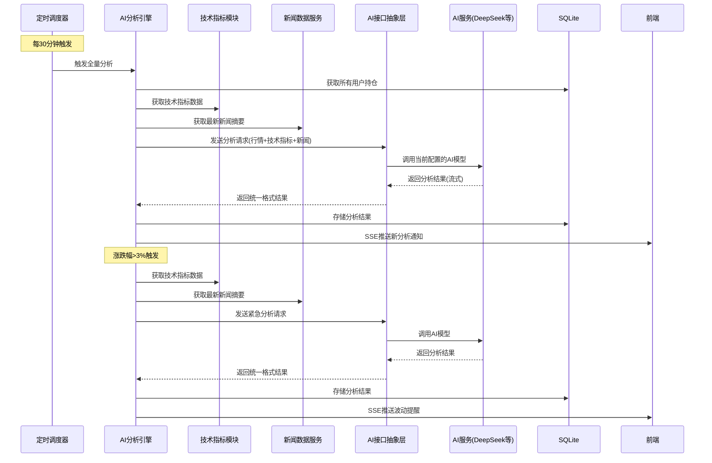
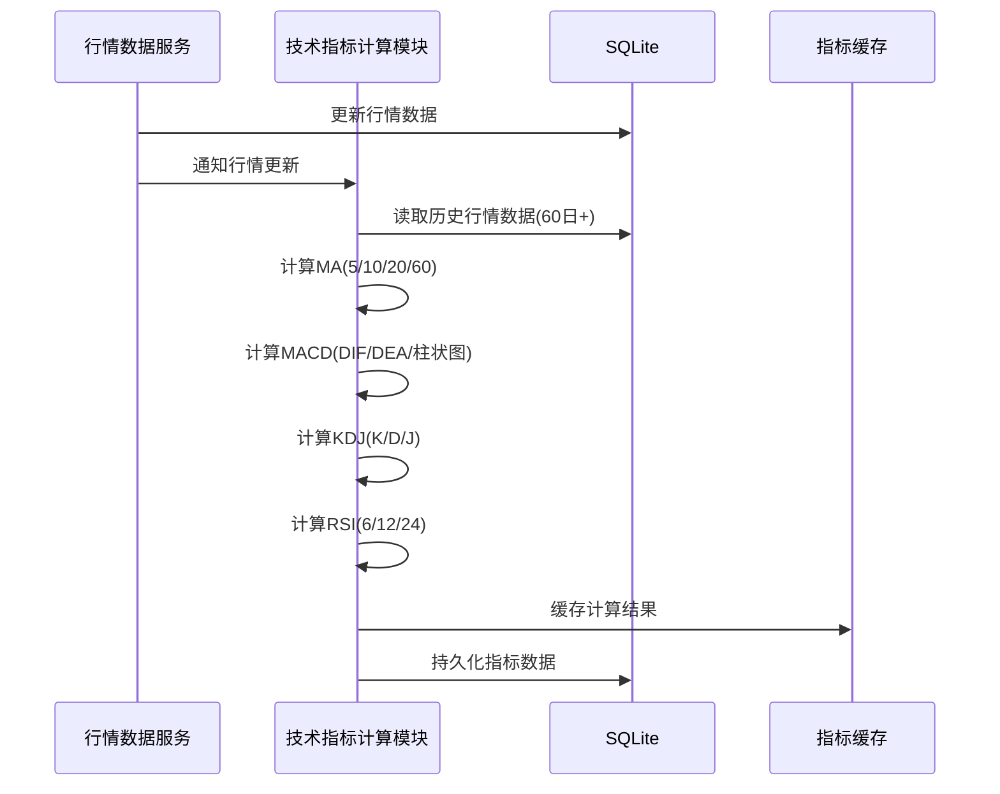

# 技术设计文档：AI智能投资陪伴助手 MVP版（第一期）

## 概述

本设计文档描述AI智能投资陪伴助手MVP版的技术架构和实现方案。系统是一个面向投资小白散户的H5网页应用，核心功能包括实时行情看板、持仓管理、AI分析陪伴、对话问答、消息中心、用户认证、技术指标计算和新闻数据获取。

技术栈：
- 前端：React 响应式H5（移动端优先）
- 后端：Node.js + Express
- AI能力：通过抽象层调用大模型（默认DeepSeek API，支持切换Claude/通义千问）
- 行情数据：A股免费公开接口（东方财富/新浪财经/腾讯财经），3-5秒刷新，多数据源自动切换
- 新闻数据：东方财富、新浪财经公开接口
- 技术指标：后端自行计算MA、MACD、KDJ、RSI，作为AI分析输入
- 数据库：SQLite（better-sqlite3）
- 部署：阿里云轻量应用服务器 2核2G Ubuntu 深圳

## 架构

### 整体架构

系统采用前后端分离的B/S架构，前端为React SPA，后端为Node.js REST API服务，通过HTTP/SSE通信。AI调用通过抽象层实现，支持多模型切换。



### 通信方式

- 前端到后端：RESTful API（CRUD操作）+ Server-Sent Events（实时行情推送）
- 后端到AI：通过AI接口抽象层调用，HTTP流式响应
- 后端到行情源：HTTP轮询，3-5秒间隔
- 后端到新闻源：HTTP请求，按需获取

选择SSE而非WebSocket的原因：行情数据是单向推送场景，SSE实现更简单、资源占用更低，适合2核2G服务器。

### 部署架构



Nginx负责：HTTPS终止、静态文件服务、API反向代理、Gzip压缩。

## 组件与接口

### 前端组件



### 后端模块

| 模块 | 职责 | 关键接口 |
|------|------|----------|
| AuthModule | 用户注册、登录、会话管理 | POST /api/auth/register, POST /api/auth/login, POST /api/auth/logout |
| PositionModule | 持仓CRUD（手动输入） | GET/POST/PUT/DELETE /api/positions |
| MarketDataService | 行情数据获取、多源切换、SSE推送 | GET /api/market/sse, GET /api/market/quote/:code |
| TechnicalIndicatorModule | 基于行情数据计算MA/MACD/KDJ/RSI | GET /api/indicators/:stockCode |
| NewsDataService | 从东方财富/新浪财经获取个股新闻摘要 | GET /api/news/:stockCode |
| AIProviderAbstraction | AI接口抽象层，统一调用接口，支持多模型切换 | 内部模块，无外部接口 |
| AIAnalysisEngine | 定时分析、触发分析、对话回复（通过抽象层调用AI） | POST /api/analysis/trigger, GET /api/analysis/:stockCode |
| ChatModule | 对话管理、消息存储 | POST /api/chat/send, GET /api/chat/history |
| MessageCenter | 消息记录、筛选、分页 | GET /api/messages, GET /api/messages/:id |
| CalmDownModule | 冷静机制触发与展示 | POST /api/calm-down/evaluate |
| SchedulerModule | 定时任务调度（分析、行情、每日关注） | 内部模块，无外部接口 |

### AI接口抽象层设计



切换策略：
- 通过配置文件 `ai.config.json` 指定当前使用的AI提供者
- `AIProviderFactory` 根据配置创建对应的Provider实例
- 所有业务代码仅依赖 `AIProvider` 接口，不直接引用具体实现
- 切换模型只需修改配置文件中的 `provider` 字段

### 关键API接口设计

#### 认证接口

```
POST /api/auth/register
Request: { username: string, password: string }
Response: { token: string, user: { id, username } }

POST /api/auth/login
Request: { username: string, password: string }
Response: { token: string, user: { id, username } }
```

#### 持仓接口

```
GET /api/positions
Response: { positions: Position[] }

POST /api/positions
Request: { stockCode: string, costPrice: number, shares: number, buyDate: string }
Response: { position: Position }

PUT /api/positions/:id
Request: { costPrice?: number, shares?: number }
Response: { position: Position }

DELETE /api/positions/:id
Response: { success: boolean }
```

#### 行情SSE接口

```
GET /api/market/sse
Headers: { Authorization: Bearer <token> }
Response: SSE stream
  event: quote
  data: { stockCode, name, price, changePercent, timestamp }
```

#### 技术指标接口

```
GET /api/indicators/:stockCode
Response: {
  stockCode: string,
  ma: { ma5: number, ma10: number, ma20: number, ma60: number },
  macd: { dif: number, dea: number, histogram: number },
  kdj: { k: number, d: number, j: number },
  rsi: { rsi6: number, rsi12: number, rsi24: number },
  signals: {
    ma: { direction: "bullish"|"neutral"|"bearish", label: string },
    macd: { direction: "bullish"|"neutral"|"bearish", label: string },
    kdj: { direction: "bullish"|"neutral"|"bearish", label: string },
    rsi: { direction: "bullish"|"neutral"|"bearish", label: string }
  },
  updatedAt: string
}
```

#### 新闻数据接口

```
GET /api/news/:stockCode?limit=10
Response: {
  news: {
    title: string,
    summary: string,
    source: string,
    publishedAt: string,
    url: string
  }[]
}
```

#### AI分析接口

```
POST /api/analysis/trigger
Request: { stockCode: string }
Response: { analysis: Analysis }

GET /api/analysis/:stockCode
Response: { analyses: Analysis[] }
```

#### 对话接口

```
POST /api/chat/send
Request: { message: string, stockCode?: string }
Response: SSE stream (流式返回AI回复)
```

#### 消息中心接口

```
GET /api/messages?type=&page=&limit=20
Response: { messages: Message[], total: number, hasMore: boolean }
```

### 行情数据多源切换机制



切换策略：
- 主数据源为东方财富，备用为新浪财经和腾讯财经
- 单次请求超时阈值2秒，超时即切换
- 连续3次成功后尝试回切主数据源
- 所有源不可用时，返回最近一次缓存数据并标注"数据延迟"

### AI分析触发流程



### 技术指标计算流程



### 新闻数据获取流程

新闻数据服务采用与行情数据类似的多源切换策略：
- 主数据源为东方财富新闻接口，备用为新浪财经新闻接口
- 单次请求超时阈值3秒
- 新闻数据缓存30分钟，避免频繁请求
- 新闻接口全部不可用时，AI分析降级为仅基于行情和技术指标

## 数据模型

### 数据库表结构

```sql
-- 用户表
CREATE TABLE users (
    id INTEGER PRIMARY KEY AUTOINCREMENT,
    username TEXT NOT NULL UNIQUE,
    password_hash TEXT NOT NULL,
    created_at DATETIME DEFAULT CURRENT_TIMESTAMP,
    failed_login_count INTEGER DEFAULT 0,
    locked_until DATETIME NULL
);

-- 持仓表
CREATE TABLE positions (
    id INTEGER PRIMARY KEY AUTOINCREMENT,
    user_id INTEGER NOT NULL,
    stock_code TEXT NOT NULL,
    stock_name TEXT NOT NULL,
    cost_price REAL NOT NULL,
    shares INTEGER NOT NULL,
    buy_date DATE NOT NULL,
    created_at DATETIME DEFAULT CURRENT_TIMESTAMP,
    updated_at DATETIME DEFAULT CURRENT_TIMESTAMP,
    FOREIGN KEY (user_id) REFERENCES users(id)
);

-- AI分析结果表
CREATE TABLE analyses (
    id INTEGER PRIMARY KEY AUTOINCREMENT,
    user_id INTEGER NOT NULL,
    stock_code TEXT NOT NULL,
    stock_name TEXT NOT NULL,
    trigger_type TEXT NOT NULL CHECK(trigger_type IN ('scheduled', 'volatility', 'manual', 'self_correction')),
    stage TEXT NOT NULL CHECK(stage IN ('bottom', 'rising', 'main_wave', 'high', 'falling')),
    space_estimate TEXT,
    key_signals TEXT,
    action_ref TEXT NOT NULL CHECK(action_ref IN ('hold', 'add', 'reduce', 'clear')),
    batch_plan TEXT,
    confidence INTEGER NOT NULL CHECK(confidence BETWEEN 0 AND 100),
    reasoning TEXT NOT NULL,
    data_sources TEXT,
    technical_indicators TEXT,
    news_summary TEXT,
    recovery_estimate TEXT,
    profit_estimate TEXT,
    risk_alerts TEXT,
    created_at DATETIME DEFAULT CURRENT_TIMESTAMP,
    FOREIGN KEY (user_id) REFERENCES users(id)
);

-- 对话记录表
CREATE TABLE chat_messages (
    id INTEGER PRIMARY KEY AUTOINCREMENT,
    user_id INTEGER NOT NULL,
    role TEXT NOT NULL CHECK(role IN ('user', 'assistant')),
    content TEXT NOT NULL,
    stock_code TEXT,
    created_at DATETIME DEFAULT CURRENT_TIMESTAMP,
    FOREIGN KEY (user_id) REFERENCES users(id)
);

-- 消息中心表
CREATE TABLE messages (
    id INTEGER PRIMARY KEY AUTOINCREMENT,
    user_id INTEGER NOT NULL,
    type TEXT NOT NULL CHECK(type IN ('scheduled_analysis', 'volatility_alert', 'self_correction', 'daily_pick', 'target_price_alert', 'ambush_recommendation')),
    stock_code TEXT NOT NULL,
    stock_name TEXT NOT NULL,
    summary TEXT NOT NULL,
    detail TEXT NOT NULL,
    analysis_id INTEGER,
    is_read INTEGER DEFAULT 0,
    created_at DATETIME DEFAULT CURRENT_TIMESTAMP,
    FOREIGN KEY (user_id) REFERENCES users(id),
    FOREIGN KEY (analysis_id) REFERENCES analyses(id)
);

-- 行情缓存表
CREATE TABLE market_cache (
    stock_code TEXT PRIMARY KEY,
    stock_name TEXT NOT NULL,
    price REAL NOT NULL,
    change_percent REAL NOT NULL,
    volume REAL,
    updated_at DATETIME DEFAULT CURRENT_TIMESTAMP
);

-- 行情历史数据表（用于技术指标计算）
CREATE TABLE market_history (
    id INTEGER PRIMARY KEY AUTOINCREMENT,
    stock_code TEXT NOT NULL,
    trade_date DATE NOT NULL,
    open_price REAL NOT NULL,
    close_price REAL NOT NULL,
    high_price REAL NOT NULL,
    low_price REAL NOT NULL,
    volume REAL NOT NULL,
    UNIQUE(stock_code, trade_date)
);

-- 技术指标缓存表
CREATE TABLE technical_indicators (
    id INTEGER PRIMARY KEY AUTOINCREMENT,
    stock_code TEXT NOT NULL,
    trade_date DATE NOT NULL,
    ma5 REAL, ma10 REAL, ma20 REAL, ma60 REAL,
    dif REAL, dea REAL, macd_histogram REAL,
    k_value REAL, d_value REAL, j_value REAL,
    rsi6 REAL, rsi12 REAL, rsi24 REAL,
    updated_at DATETIME DEFAULT CURRENT_TIMESTAMP,
    UNIQUE(stock_code, trade_date)
);

-- 沪深300成分股表
CREATE TABLE hs300_constituents (
    stock_code TEXT PRIMARY KEY,
    stock_name TEXT NOT NULL,
    weight REAL,
    updated_at DATETIME DEFAULT CURRENT_TIMESTAMP
);

-- 新闻缓存表
CREATE TABLE news_cache (
    id INTEGER PRIMARY KEY AUTOINCREMENT,
    stock_code TEXT NOT NULL,
    title TEXT NOT NULL,
    summary TEXT NOT NULL,
    source TEXT NOT NULL,
    published_at DATETIME NOT NULL,
    url TEXT,
    fetched_at DATETIME DEFAULT CURRENT_TIMESTAMP
);

-- AI配置表
CREATE TABLE ai_config (
    key TEXT PRIMARY KEY,
    value TEXT NOT NULL,
    updated_at DATETIME DEFAULT CURRENT_TIMESTAMP
);
```

### 关键数据结构（TypeScript）

```typescript
// 持仓
interface Position {
    id: number;
    userId: number;
    stockCode: string;
    stockName: string;
    costPrice: number;
    shares: number;
    buyDate: string;
    // 计算字段（来自行情数据）
    currentPrice?: number;
    changePercent?: number;
    profitLoss?: number;
    profitLossPercent?: number;
    holdingDays?: number;
}

// AI分析结果
interface Analysis {
    id: number;
    userId: number;
    stockCode: string;
    stockName: string;
    triggerType: 'scheduled' | 'volatility' | 'manual' | 'self_correction';
    stage: 'bottom' | 'rising' | 'main_wave' | 'high' | 'falling';
    spaceEstimate: string;
    keySignals: string[];
    actionRef: 'hold' | 'add' | 'reduce' | 'clear';
    batchPlan: BatchStep[];
    confidence: number;
    reasoning: string;
    dataSources: string[];
    technicalIndicators?: TechnicalIndicatorData;
    newsSummary?: string[];
    holdingDays?: number;
    recoveryEstimate?: string;
    profitEstimate?: string;
    riskAlerts?: RiskAlert[];
    targetPrice?: { low: number; high: number };
    positionStrategy?: {
        profitPosition: { percent: number; action: string };
        basePosition: { percent: number; action: string };
    };
    createdAt: string;
}

// 分批操作方案
interface BatchStep {
    action: 'buy' | 'sell';
    shares: number;
    targetPrice: number;
    note: string;
}

// 行情数据
interface MarketQuote {
    stockCode: string;
    stockName: string;
    price: number;
    changePercent: number;
    volume: number;
    timestamp: string;
}

// 技术指标数据
interface TechnicalIndicatorData {
    stockCode: string;
    tradeDate: string;
    ma: { ma5: number; ma10: number; ma20: number; ma60: number };
    macd: { dif: number; dea: number; histogram: number };
    kdj: { k: number; d: number; j: number };
    rsi: { rsi6: number; rsi12: number; rsi24: number };
    // 信号灯解读（前端展示用）
    signals: {
        ma: { direction: 'bullish' | 'neutral' | 'bearish'; label: string };
        macd: { direction: 'bullish' | 'neutral' | 'bearish'; label: string };
        kdj: { direction: 'bullish' | 'neutral' | 'bearish'; label: string };
        rsi: { direction: 'bullish' | 'neutral' | 'bearish'; label: string };
    };
    updatedAt: string;
}

// 新闻摘要
interface NewsItem {
    title: string;
    summary: string;
    source: string;
    publishedAt: string;
    url?: string;
}

// AI提供者配置
interface AIConfig {
    provider: 'deepseek' | 'claude' | 'qwen';
    apiKey: string;
    baseUrl: string;
    model: string;
    maxTokens?: number;
    temperature?: number;
}

// AI提供者接口
interface AIProvider {
    analyze(prompt: string, context: AIContext): AsyncIterable<string>;
    chat(messages: ChatMessage[]): AsyncIterable<string>;
    getModelName(): string;
}

// AI分析上下文（传递给AI的输入数据）
interface AIContext {
    marketData: MarketQuote;
    technicalIndicators: TechnicalIndicatorData;
    newsItems?: NewsItem[];
    positionData?: Position;
    historicalAnalyses?: Analysis[];
}

// 沪深300成分股
interface HS300Constituent {
    stockCode: string;
    stockName: string;
    weight: number;
}

// 消息
interface Message {
    id: number;
    userId: number;
    type: 'scheduled_analysis' | 'volatility_alert' | 'self_correction' | 'daily_pick' | 'target_price_alert' | 'ambush_recommendation';
    stockCode: string;
    stockName: string;
    summary: string;
    detail: string;
    analysisId?: number;
    isRead: boolean;
    createdAt: string;
}

// 冷静机制评估结果
interface CalmDownEvaluation {
    stockCode: string;
    buyLogicReview: string;
    sellType: 'rational' | 'emotional';
    sellTypeReasoning: string;
    worstCaseEstimate: string;
}

// 主力行为风险提示
interface RiskAlert {
    type: 'volume_divergence' | 'late_spike' | 'false_breakout' | 'cross_validation_conflict';
    level: 'warning' | 'danger';
    label: string;
    explanation: string;
}
```

## 正确性属性

*属性是一种在系统所有有效执行中都应成立的特征或行为——本质上是关于系统应该做什么的形式化陈述。属性是人类可读规范与机器可验证正确性保证之间的桥梁。*

### 属性 1：注册-登录往返

*对于任意*有效的用户名和密码组合，注册后使用相同凭据登录应成功返回有效token，且token可用于访问受保护资源。

**验证需求：1.1, 1.2**

### 属性 2：用户名唯一性约束

*对于任意*已注册的用户名，使用该用户名再次注册应被拒绝并返回错误。

**验证需求：1.3**

### 属性 3：未认证请求拦截

*对于任意*受保护的API端点和任意无效/缺失的认证token，请求应返回401未授权状态码。

**验证需求：1.5**

### 属性 4：持仓数据与技术指标展示完整性

*对于任意*持仓记录、对应的行情数据和技术指标数据，渲染结果应包含以下所有字段：股票名称、股票代码、当前价格、涨跌幅、成本价、持有份额、盈亏金额、盈亏比例、关键技术指标信号灯状态（MA趋势、MACD信号、KDJ状态、RSI区间，每项含方向标签和一句话解读）。

**验证需求：2.2, 11.4**

### 属性 5：行情数据源故障切换

*对于任意*数据源故障场景，当当前数据源请求失败时，系统应自动切换至下一个可用数据源并成功返回行情数据。

**验证需求：2.3**

### 属性 6：涨跌幅触发分析

*对于任意*持仓股票，当其涨跌幅绝对值超过3%时，AI分析引擎应触发一次针对该股票的分析任务。

**验证需求：3.2**

### 属性 7：AI分析结果结构完整性

*对于任意*AI分析结果，应包含以下所有字段：当前阶段（底部/上升/主升浪/高位/下跌之一）、上方空间预估、关键信号提示、操作参考方案（持有/加仓/减仓/清仓之一）、分批操作方案、置信度（0-100整数）、非空推理过程。

**验证需求：3.4, 3.5**

### 属性 8：AI输出合规措辞

*对于任意*AI生成的文本输出（包括分析结果和对话回复），不应包含"建议""推荐"等具有投资顾问含义的措辞，应使用"参考方案"等合规措辞。

**验证需求：3.7, 6.3**

### 属性 9：持仓CRUD往返

*对于任意*有效的持仓数据（有效股票代码、正数成本价、正整数份额、合法日期），创建持仓后查询应返回相同数据；更新后查询应返回更新后的数据。

**验证需求：4.1**

### 属性 10：无效股票代码拒绝

*对于任意*不存在于A股市场的股票代码，创建持仓请求应被拒绝并返回错误。

**验证需求：4.2**

### 属性 11：盈亏计算正确性

*对于任意*持仓记录（成本价、份额）和当前行情价格，盈亏金额应等于 (当前价 - 成本价) × 份额，盈亏比例应等于 (当前价 - 成本价) / 成本价 × 100%。

**验证需求：4.3**

### 属性 12：持仓删除完整性

*对于任意*已存在的持仓记录，删除后查询该持仓应返回不存在。

**验证需求：4.4**

### 属性 13：冷静机制触发与内容完整性

*对于任意*包含卖出意愿的用户消息和对应的持仓记录，冷静机制应触发并返回包含以下所有内容的评估结果：买入逻辑回顾、理性/情绪卖出判断及理由、最坏情况预估。

**验证需求：5.2**

### 属性 14：波动分析报告完整性

*对于任意*涨跌幅超过5%的持仓股票，生成的波动分析报告应包含波动原因，且数据支撑应包含行业指数变动、成交量变化、新闻摘要中的至少两项。

**验证需求：5.1, 5.3**

### 属性 15：自我修正检测

*对于任意*历史分析结果，当实际走势与参考方案存在明显偏差时，系统应生成包含偏差原因和修正分析的自我修正报告。

**验证需求：5.4, 9.5**

### 属性 16：消息列表排序与完整性

*对于任意*消息列表查询结果，消息应按创建时间降序排列，且每条消息应包含消息类型、关联股票名称和代码、生成时间、摘要内容。

**验证需求：7.1, 7.2**

### 属性 17：消息类型筛选正确性

*对于任意*消息类型筛选条件，返回结果中所有消息的类型应与筛选条件完全匹配。

**验证需求：7.4**

### 属性 18：消息分页限制

*对于任意*分页查询请求，返回结果数量应不超过20条，且hasMore字段应正确反映是否还有更多数据。

**验证需求：7.5**

### 属性 19：未读消息计数准确性

*对于任意*用户的消息集合，未读消息角标数字应等于该用户所有is_read为false的消息数量。

**验证需求：8.3**

### 属性 20：渐进式信任策略

*对于任意*新注册用户（使用时长低于阈值），AI分析引擎生成的参考方案应仅包含低风险操作（持有或减仓），不应包含加仓等高风险操作。

**验证需求：9.4**

### 属性 21：技术指标计算正确性

*对于任意*有效的行情历史数据序列（至少60个交易日），技术指标计算模块计算的MA（5/10/20/60日）、MACD（DIF/DEA/柱状图）、KDJ（K/D/J）、RSI（6/12/24日）应与标准公式的参考实现计算结果一致。

**验证需求：11.1**

### 属性 22：行情更新触发指标重算

*对于任意*股票代码，当行情数据更新后，该股票的技术指标缓存应被刷新，且更新时间戳应晚于行情数据更新时间。

**验证需求：11.2**

### 属性 23：AI分析输入数据完整性

*对于任意*AI分析请求，发送给AI模型的上下文数据应包含预计算的技术指标数据；当新闻数据可用时，还应包含最近的个股新闻摘要。AI不应被要求自行推算技术指标。

**验证需求：11.3, 13.2**

### 属性 24：AI提供者接口一致性

*对于任意*AI提供者实现（DeepSeek/Claude/通义千问），通过相同的配置结构创建的Provider实例应遵循相同的AIProvider接口契约，且通过修改配置文件中的provider字段即可完成切换。

**验证需求：12.1, 12.2**

### 属性 25：新闻数据结构完整性

*对于任意*股票代码的新闻查询结果，每条新闻应包含标题、摘要、来源、发布时间四个必要字段，且摘要内容应与查询的股票相关。

**验证需求：13.1**

### 属性 26：新闻服务降级不中断分析

*对于任意*新闻数据接口不可用的场景，AI分析引擎应仍能基于行情数据和技术指标正常生成分析结果，不因新闻数据缺失而返回错误或中断服务。

**验证需求：13.3**

### 属性 27：每日关注限定沪深300

*对于任意*每日关注推荐结果，推荐的股票代码必须属于沪深300成分股列表，且必须包含预估目标价位区间（最低目标价和最高目标价均为正数且高于当前价格）和预估上升空间百分比（为正数）。

**验证需求：10.1, 10.2**

### 属性 28：持仓天数计算正确性

*对于任意*持仓记录的买入日期和当前日期，持仓天数应等于当前日期与买入日期之间的自然日差值。

**验证需求：4.5, 15.1**

### 属性 29：回本预估与收益预估合规性

*对于任意*AI生成的回本预估或收益预估文本，不应包含"保证""承诺""一定"等绝对性措辞，应使用"参考预估""预计""可能"等合规措辞，且必须附带风险提示。

**验证需求：15.4, 15.5**

### 属性 30：置信度等级标签正确性

*对于任意*置信度数值，展示的等级标签应与数值范围严格对应：80-100为高置信（🟢），60-79为中置信（🟡），0-59为低置信（🔴）。

**验证需求：3.7**

### 属性 31：每日关注候选池技术指标过滤

*对于任意*每日关注的候选池股票，应满足以下技术指标条件中的至少三项：MACD金叉或即将金叉、RSI在30-70区间、近5日成交量放大、股价在MA20附近或上方。

**验证需求：10.1**

### 属性 32：交叉验证置信度降级

*对于任意*AI分析结果，当技术面信号方向与基本面（新闻情绪）或资金面（量价关系）方向矛盾时，置信度应低于同等条件下无矛盾时的置信度，且分析结果应包含主力诱导风险提示。

**验证需求：16.1**

### 属性 33：可疑形态检测完整性

*对于任意*行情数据序列，当出现量价背离（成交量增加但股价涨幅不足1%或下跌）、尾盘异动（最后30分钟涨跌幅占比超50%）、假突破（突破后次日回落）中的任一形态时，系统应标记对应的风险类型。

**验证需求：16.2**

### 属性 34：每日关注排除高风险候选

*对于任意*每日关注最终推荐结果，推荐的股票不应存在已被检测到的明显主力诱导风险标记。

**验证需求：16.4**

### 属性 35：每日关注三周期覆盖

*对于任意*每日关注推荐结果，应包含恰好3只股票，分别标记为短期（1-2周）、中期（1-3个月）、中长期（3个月以上），且三只股票的周期标签互不相同。

**验证需求：10.1, 10.2**

### 属性 36：分仓操作方案完整性

*对于任意*盈利持仓的AI分析结果，参考方案应区分利润仓和底仓，并分别给出操作参考；当短期涨幅超过10%时，应包含分批减仓方案。

**验证需求：17.1, 17.2, 17.3**

### 属性 37：目标价提醒触发正确性

*对于任意*设定了目标价位的持仓股票，当股价达到目标价的90%时应生成"接近目标价"消息，当达到或超过目标价时应生成"到达目标价"消息。

**验证需求：18.1, 18.2**

### 属性 38：清仓后埋伏推荐触发

*对于任意*被删除的持仓记录，系统应在24小时内生成1-2只低位埋伏候选标的的推荐消息，且候选标的必须属于沪深300成分股。

**验证需求：18.3, 18.4**

## 错误处理

### 前端错误处理

| 错误场景 | 处理方式 |
|----------|----------|
| 网络请求失败 | 显示Toast提示"网络异常，请检查网络连接"，自动重试1次 |
| API返回4xx | 根据错误码显示对应中文提示（如401跳转登录页） |
| API返回5xx | 显示Toast提示"服务器繁忙，请稍后重试" |
| SSE连接断开 | 自动重连，最多重试3次，间隔递增（1s/3s/5s） |
| AI回复超时（30s） | 显示"分析超时，请稍后重试"提示 |
| 技术指标加载失败 | 显示"指标计算中"占位符，后台重试 |
| 新闻数据加载失败 | 隐藏新闻区域，不影响其他功能展示 |

### 后端错误处理

| 错误场景 | 处理方式 |
|----------|----------|
| AI服务调用失败（任意提供者） | 重试2次（间隔2s），仍失败则返回"AI服务暂时不可用"错误 |
| AI服务限流 | 排队等待，超过60s返回超时错误 |
| 行情数据源全部不可用 | 返回缓存数据，标注数据延迟时间 |
| 新闻数据源全部不可用 | AI分析降级为仅基于行情+技术指标，不中断服务 |
| 技术指标计算失败（数据不足） | 返回可计算的指标，不足部分标注null |
| SQLite写入失败 | 事务回滚，返回500错误 |
| 用户认证token过期 | 返回401，前端跳转登录页 |
| 请求参数校验失败 | 返回400，附带具体字段错误信息 |
| 沪深300成分股列表更新失败 | 使用上次缓存的列表，记录告警日志 |

### 全局错误处理策略

- 后端统一错误响应格式：`{ error: { code: string, message: string, details?: any } }`
- 前端统一拦截器处理HTTP错误，401自动跳转登录
- 所有错误记录到服务器日志（console + 文件轮转）
- 关键错误（数据库异常、AI服务不可用）记录告警日志

## 测试策略

### 单元测试

使用 Jest 作为测试框架，覆盖以下关键模块：

- **认证模块**：密码哈希验证、token生成与校验、账户锁定逻辑
- **持仓模块**：CRUD操作、数据校验、盈亏计算
- **行情数据服务**：数据源切换逻辑、缓存机制、数据格式化
- **技术指标计算模块**：MA/MACD/KDJ/RSI各指标的边界条件（数据不足、极端值）
- **新闻数据服务**：多源切换、缓存过期、数据解析
- **AI接口抽象层**：Provider工厂创建、配置加载、接口契约验证
- **AI分析引擎**：触发条件判断、结果结构校验、合规措辞检查、输入数据组装
- **消息中心**：排序、筛选、分页逻辑
- **冷静机制**：卖出意愿检测、评估结果结构
- **每日关注**：沪深300成分股筛选验证

单元测试聚焦于具体示例、边界条件和错误场景，避免编写过多重复的单元测试。

### 属性测试

使用 fast-check 作为属性测试库，每个属性测试至少运行100次迭代。

每个属性测试必须通过注释引用设计文档中的属性编号：

```typescript
// Feature: ai-investment-assistant, Property 21: 技术指标计算正确性
test('MA计算应与标准公式一致', () => {
  fc.assert(fc.property(
    fc.array(fc.float({ min: 1, max: 1000, noNaN: true }), { minLength: 60, maxLength: 200 }),
    (closePrices) => {
      const result = calculateMA(closePrices, 5);
      const expected = closePrices.slice(-5).reduce((a, b) => a + b, 0) / 5;
      return Math.abs(result - expected) < 0.0001;
    }
  ), { numRuns: 100 });
});

// Feature: ai-investment-assistant, Property 24: AI提供者接口一致性
test('所有AI提供者应遵循相同接口', () => {
  fc.assert(fc.property(
    fc.constantFrom('deepseek', 'claude', 'qwen'),
    (providerName) => {
      const provider = AIProviderFactory.createProvider({ provider: providerName, ... });
      return typeof provider.analyze === 'function'
        && typeof provider.chat === 'function'
        && typeof provider.getModelName === 'function';
    }
  ), { numRuns: 100 });
});
```

属性测试覆盖设计文档中定义的所有38个正确性属性，每个属性对应一个属性测试用例。

### 测试分工

- **单元测试**：验证具体示例、边界条件（如账户锁定阈值、空输入处理、技术指标数据不足、新闻缓存过期）、错误条件（如无效股票代码、网络超时、AI提供者不可用）
- **属性测试**：验证跨所有输入的通用属性（如盈亏计算公式、消息排序、合规措辞、技术指标计算正确性、AI接口一致性、新闻数据结构完整性）
- 两者互补：单元测试捕获具体bug，属性测试验证通用正确性

### 前端测试

使用 React Testing Library 进行组件测试：
- 关键交互流程（登录、添加持仓、发送消息）
- 组件渲染完整性（股票卡片字段、技术指标展示、导航栏TAB）
- 错误状态展示（网络异常、超时提示、新闻加载失败降级）
