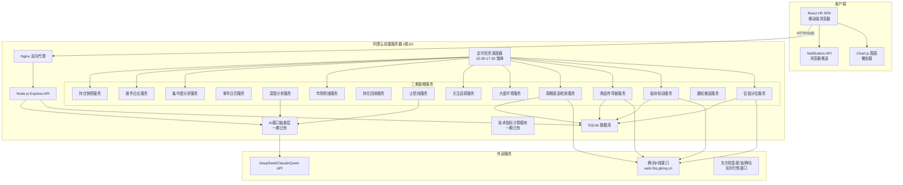
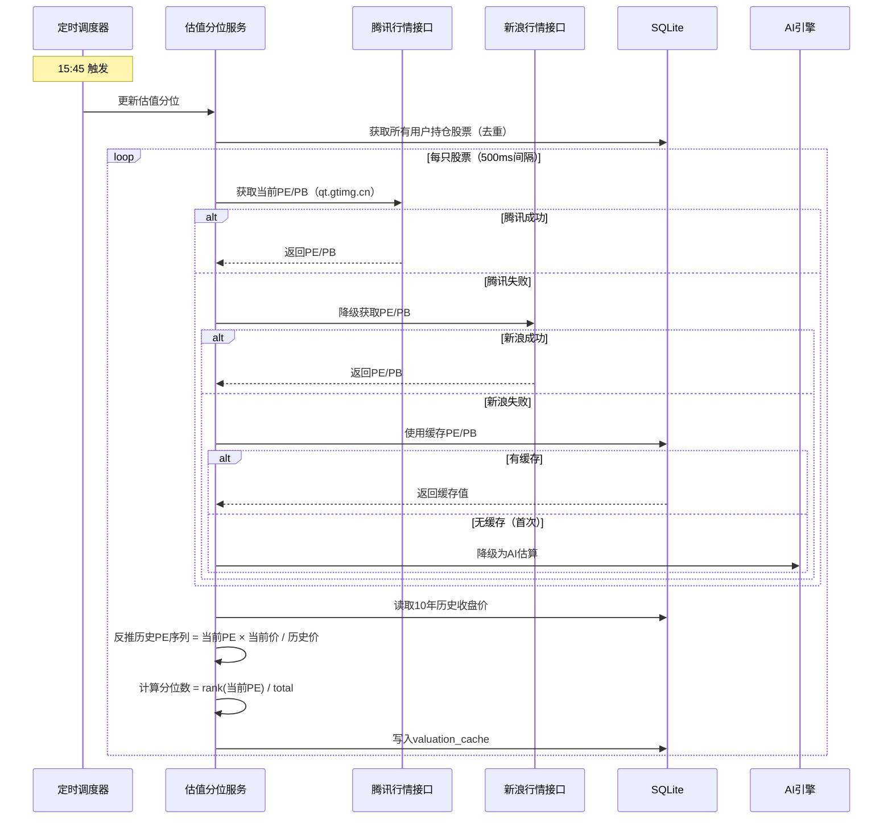
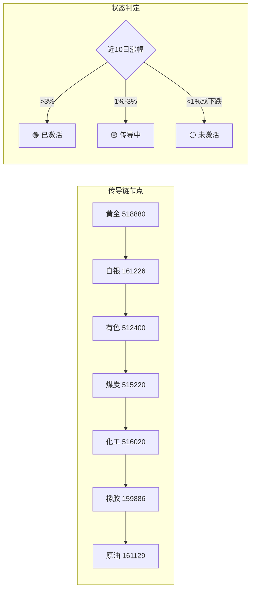
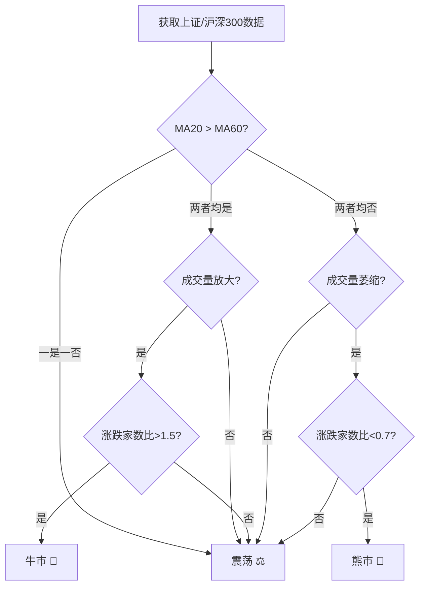
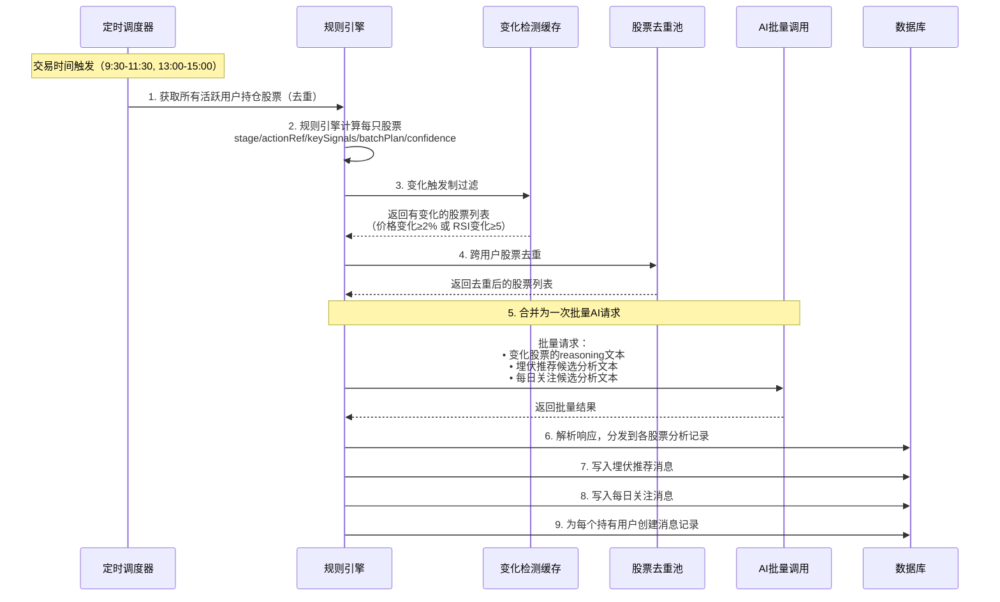

# 技术设计文档：AI智能投资陪伴助手 第二期

## 概述

本设计文档描述AI智能投资陪伴助手第二期的技术架构和实现方案。第二期基于第一期已完成的基础架构（用户认证、实时行情、AI分析、持仓管理、消息中心、AI对话等），新增16个功能模块，核心围绕语风swiss投资方法论（估值分位、板块轮动、商品传导链、事件驱动、深度分析报告、周期底部检测、持仓回测）和核心留存功能（止损线、大盘环境、每日关注追踪、市场情绪、集中度风险、操作复盘、消息推送、量化可视化）。

技术栈延续第一期：
- 前端：React H5（移动端优先）+ Vite + Chart.js（新增，懒加载）
- 后端：Node.js + Express + SQLite（better-sqlite3）
- AI能力：通过抽象层调用大模型（DeepSeek/Claude/通义千问）
- 行情数据：腾讯K线（historyService）+ 多源实时行情（东方财富→新浪→腾讯）
- 测试：Jest + fast-check（属性测试）
- 部署：阿里云轻量应用服务器 2核2G Ubuntu

关键设计原则：
- 估值分位、板块轮动、商品传导链、周期检测、市场情绪、持仓回测、事件日历等功能均为**纯数据计算**，不调用AI，零额外费用
- 所有新增定时任务在15:30-17:30错峰执行，避免2核2G服务器资源争抢
- 使用"参考方案"措辞，不使用"建议""推荐"（功能名称如"埋伏推荐"除外）

### 一期行为调整（二期实施）

1. **SSE实时行情推送频率调整**：一期SSE推送间隔为5秒（`SSE_POLL_INTERVAL_MS = 5000`），二期改为30分钟（`SSE_POLL_INTERVAL_MS = 1800000`）。SSE仅调用免费行情API，不涉及AI调用，无费用影响。修改文件：`server/src/market/marketRoutes.ts`。
2. **底部Tab切换触发行情刷新**：用户点击底部导航tab时，触发一次主动行情数据刷新（调用 `/api/market/quotes` 或重连SSE），确保切换到看板/持仓页时数据是最新的。修改文件：`client/src/components/BottomNav.tsx`（触发刷新事件）、`client/src/pages/DashboardPage.tsx`（监听刷新）。纯行情API调用，无AI费用。

## 架构

### 整体架构（第二期扩展）

第二期在第一期架构基础上新增以下模块，不改变整体B/S架构和通信方式：



### 定时任务调度时间表

所有收盘后定时任务在15:30-17:30分批串行执行，每个任务完成后再启动下一个：

```mermaid
gantt
    title 收盘后定时任务调度（15:30-17:30）
    dateFormat HH:mm
    axisFormat %H:%M

    section 一期已有
    K线增量更新           :k, 15:30, 15m

    section 二期新增
    估值分位数据更新       :v, 15:45, 15m
    板块轮动阶段判断       :r, 16:00, 10m
    商品传导链状态更新     :ch, 16:10, 10m
    大盘环境判断           :me, 16:20, 10m
    市场情绪指数计算       :si, 16:30, 10m
    周期底部检测           :cy, 16:40, 10m
    每日关注追踪           :dt, 16:50, 10m
    持仓集中度检查         :cc, 17:00, 10m
    持仓快照记录           :ps, 17:10, 10m
    操作复盘评价生成       :rv, 17:20, 10m
```



### 交易日判断守卫

所有收盘后定时任务在执行前必须先判断当天是否为A股交易日，非交易日（周末、法定节假日）直接跳过，避免无效的API调用和资源消耗。

```typescript
// server/src/scheduler/tradingDayGuard.ts

/**
 * 判断指定日期是否为A股交易日
 * 策略：
 * 1. 排除周六日
 * 2. 排除法定节假日（内置年度节假日表，每年初更新）
 * 3. 包含调休补班日（周末但需上班的日子）
 * 4. 兜底：尝试从腾讯K线接口获取当天是否有数据来验证
 */
function isTradingDay(date: Date): boolean;
```

节假日数据维护方式：
- 内置当年和下一年的A股休市日期表（JSON配置文件 `server/src/scheduler/holidays.json`）
- 每年12月由管理员更新下一年的节假日数据（国务院发布后手动更新）
- 兜底机制：如果节假日表缺失，回退到仅判断周六日 + 尝试从腾讯接口验证

一期已有的定时分析（每小时触发）同样需要加入交易日+交易时间守卫：仅在交易日的 9:30-11:30 和 13:00-15:00 期间触发盘中定时分析（午休11:30-13:00不触发）。

### 前端页面结构（第二期扩展）

```mermaid
graph TB
    subgraph 页面组件
        P1[LoginPage 登录页<br/>一期已有]
        P2[DashboardPage 看板页<br/>扩展]
        P3[PositionPage 持仓页<br/>扩展]
        P4[ChatPage 对话页<br/>一期已有]
        P5[MessageCenterPage 消息中心<br/>扩展]
        P6[ProfilePage 我的页<br/>扩展]
    end

    subgraph 二期新增子页面
        SP1[NotificationSettingsPage 通知设置]
        SP2[AnalysisSettingsPage 分析设置]
        SP3[AboutPage 关于]
        SP4[OperationLogPage 操作复盘]
        SP5[DeepReportHistoryPage 历史报告]
        SP6[AccuracyStatsPage AI准确率]
    end

    subgraph 二期新增组件
        C1[ValuationTag 估值分位标签]
        C2[RotationTag 轮动阶段标签]
        C3[SentimentTag 情绪指数标签]
        C4[SentimentGauge 情绪仪表盘]
        C5[CommodityChain 传导链流程图]
        C6[EventCalendar 事件日历卡片]
        C7[CycleMonitor 周期监控卡片]
        C8[StopLossIndicator 止损线标记]
        C9[MarketEnvTag 大盘环境标签]
        C10[DeepReportModal 深度报告弹窗]
        C11[BacktestPanel 回测结果面板]
        C12[ProfitChart 收益曲线图]
        C13[SectorPieChart 板块分布饼图]
        C14[PnlBarChart 盈亏柱状图]
    end

    P6 --> SP1 & SP2 & SP3 & SP4 & SP5 & SP6
    P2 --> C1 & C2 & C3 & C4 & C5 & C6 & C7 & C9
    P3 --> C1 & C8 & C10 & C11
    P6 --> C12 & C13 & C14
```



## 组件与接口

### 二期新增后端模块

| 模块 | 文件路径 | 职责 | 关键接口 |
|------|----------|------|----------|
| ValuationService | `server/src/valuation/valuationService.ts` | PE/PB分位计算、多源降级获取、缓存 | GET /api/valuation/:stockCode |
| RotationService | `server/src/rotation/rotationService.ts` | 板块轮动阶段判断（ETF涨幅+量能） | GET /api/rotation/current |
| CommodityChainService | `server/src/chain/commodityChainService.ts` | 传导链节点状态计算 | GET /api/chain/status |
| EventCalendarService | `server/src/events/eventCalendarService.ts` | 事件日历CRUD、窗口期计算、种子数据 | GET/POST/PUT/DELETE /api/events |
| DeepAnalysisService | `server/src/analysis/deepAnalysisService.ts` | 语风框架深度报告生成（调用AI） | POST /api/analysis/deep/:stockCode |
| CycleDetectorService | `server/src/cycle/cycleDetectorService.ts` | 周期底部信号检测 | GET /api/cycle/monitors, POST /api/cycle/monitors |
| BacktestService | `server/src/backtest/backtestService.ts` | 历史估值回测计算 | POST /api/backtest/:stockCode |
| StopLossService | `server/src/stoploss/stopLossService.ts` | 止损线设置、触发检测、AI评估 | PUT /api/positions/:id/stoploss |
| MarketEnvService | `server/src/marketenv/marketEnvService.ts` | 大盘环境综合判断（牛市/震荡/熊市） | GET /api/market-env/current |
| DailyPickTrackingService | `server/src/dailypick/dailyPickTrackingService.ts` | 每日关注后续追踪（3/7/14/30天） | GET /api/daily-pick/tracking |
| SentimentService | `server/src/sentiment/sentimentService.ts` | 市场情绪指数计算（0-100） | GET /api/sentiment/current |
| ConcentrationService | `server/src/concentration/concentrationService.ts` | 持仓集中度分析 | GET /api/concentration/:userId |
| OperationLogService | `server/src/oplog/operationLogService.ts` | 操作日志记录、复盘评价生成 | GET /api/oplog, GET /api/oplog/review |
| NotificationService | `server/src/notification/notificationService.ts` | 浏览器推送通知管理 | POST /api/notification/subscribe, GET/PUT /api/notification/settings |
| SnapshotService | `server/src/snapshot/snapshotService.ts` | 持仓快照记录（量化可视化数据源） | GET /api/snapshot/chart-data |
| UserSettingsService | `server/src/settings/userSettingsService.ts` | 用户分析设置、通知设置 | GET/PUT /api/settings |

### 关键API接口设计

#### 估值分位接口

```
GET /api/valuation/:stockCode
Response: {
  stockCode: string,
  peValue: number | null,
  pbValue: number | null,
  pePercentile: number,        // 0-100
  pbPercentile: number,        // 0-100
  peZone: 'low' | 'fair' | 'high',
  pbZone: 'low' | 'fair' | 'high',
  dataYears: number,           // 实际使用的数据年限
  source: 'tencent' | 'sina' | 'cache' | 'ai_estimate',
  updatedAt: string
}
```

#### 板块轮动接口

```
GET /api/rotation/current
Response: {
  currentPhase: 'P1' | 'P2' | 'P3',
  phaseLabel: string,          // "科技成长" | "周期品" | "消费白酒"
  etfPerformance: {
    tech: { code: '515000', change20d: number, volumeRatio: number },
    cycle: { code: '512400', change20d: number, volumeRatio: number },
    consumer: { code: '159928', change20d: number, volumeRatio: number }
  },
  previousPhase: 'P1' | 'P2' | 'P3' | null,
  switchedAt: string | null,
  updatedAt: string
}
```

#### 商品传导链接口

```
GET /api/chain/status
Response: {
  nodes: {
    symbol: string,            // ETF代码
    name: string,              // 黄金/白银/有色/煤炭/化工/橡胶/原油
    shortName: string,         // Au/Ag/Cu/煤/化/胶/油
    status: 'activated' | 'transmitting' | 'inactive',
    change10d: number          // 近10日涨跌幅
  }[],
  updatedAt: string
}
```

#### 事件日历接口

```
GET /api/events?days=7
Response: {
  events: {
    id: number,
    name: string,
    eventDate: string,
    eventEndDate: string | null,
    category: string,
    relatedSectors: string[],
    windowStatus: 'before_build' | 'during_watch' | 'after_take_profit',
    windowLabel: string,       // "事件前·可建仓" | "事件中·观望" | "利好兑现·可减仓"
    tip: string,
    beforeDays: number,
    afterDays: number
  }[]
}

POST /api/events
Request: {
  name: string,
  eventDate: string,
  eventEndDate?: string,
  category: string,
  relatedSectors: string[],
  beforeDays: number,
  afterDays: number,
  tip?: string
}
```

#### 深度分析报告接口

```
POST /api/analysis/deep/:stockCode
Response: SSE stream | {
  reportId: number,
  status: 'generating' | 'completed',
  message?: string             // 超时时返回提示
}

GET /api/analysis/deep/history?stockCode=&page=1&limit=20
Response: {
  reports: DeepReport[],
  total: number,
  hasMore: boolean
}
```

#### 周期监控接口

```
GET /api/cycle/monitors
Response: {
  monitors: {
    id: number,
    stockCode: string,
    stockName: string,
    cycleLength: string,       // "约6年"
    currentPhase: string,      // "横盘末期"
    status: 'bottom' | 'falling' | 'rising' | 'high',
    description: string,
    updatedAt: string
  }[]
}

POST /api/cycle/monitors
Request: { stockCode: string }

DELETE /api/cycle/monitors/:id
```

#### 持仓回测接口

```
POST /api/backtest/:stockCode
Response: {
  stockCode: string,
  currentPercentile: number,
  matchingPoints: number,      // 历史相似估值时点数量
  results: {
    period: '30d' | '90d' | '180d' | '365d',
    winRate: number,           // 盈利概率
    avgReturn: number,
    maxReturn: number,
    maxLoss: number,
    medianReturn: number
  }[],
  sampleWarning: boolean,      // matchingPoints < 5 时为 true
  disclaimer: string
}
```

#### 止损线接口

```
PUT /api/positions/:id/stoploss
Request: { stopLossPrice: number }
Response: { position: PositionResponse }

GET /api/stoploss/check
Response: {
  alerts: {
    positionId: number,
    stockCode: string,
    stockName: string,
    stopLossPrice: number,
    currentPrice: number,
    triggered: boolean
  }[]
}
```

#### 大盘环境接口

```
GET /api/market-env/current
Response: {
  environment: 'bull' | 'sideways' | 'bear',
  label: string,               // "牛市 🐂" | "震荡 ⚖️" | "熊市 🐻"
  confidenceAdjust: number,    // 熊市时 -10~-20，其他为 0
  riskTip: string | null,      // 熊市时附加风险提示
  indicators: {
    shIndex: { ma20Trend: string, ma60Trend: string },
    hs300: { ma20Trend: string, ma60Trend: string },
    volumeChange: number,
    advanceDeclineRatio: number
  },
  updatedAt: string
}
```

#### 每日关注追踪接口

```
GET /api/daily-pick/tracking
Response: {
  trackings: {
    pickId: number,
    stockCode: string,
    stockName: string,
    pickDate: string,
    pickPrice: number,
    trackingDays: number,      // 3/7/14/30
    currentPrice: number,
    returnPercent: number,
    status: 'profit' | 'loss'
  }[]
}

GET /api/daily-pick/accuracy
Response: {
  totalPicks: number,
  profitCount: number,
  lossCount: number,
  avgReturn: number,
  winRate: number
}
```

#### 市场情绪接口

```
GET /api/sentiment/current
Response: {
  score: number,               // 0-100
  label: string,               // "极度恐慌"|"恐慌"|"中性"|"贪婪"|"极度贪婪"
  emoji: string,               // 😱|😰|😐|😊|🤑
  components: {
    volumeRatio: number,       // 成交量/20日均量
    shChangePercent: number,
    hs300ChangePercent: number
  },
  updatedAt: string
}
```

#### 持仓集中度接口

```
GET /api/concentration
Response: {
  sectors: {
    sectorName: string,
    percentage: number,
    stockCount: number,
    totalValue: number
  }[],
  riskLevel: 'safe' | 'warning' | 'danger',
  warningMessage: string | null
}
```

#### 操作日志接口

```
GET /api/oplog?page=1&limit=20
Response: {
  logs: {
    id: number,
    operationType: 'create' | 'update' | 'delete',
    stockCode: string,
    stockName: string,
    price: number | null,
    shares: number | null,
    aiSummary: string | null,
    review7d: string | null,
    review30d: string | null,
    createdAt: string
  }[],
  total: number,
  hasMore: boolean
}
```

#### 通知设置接口

```
GET /api/notification/settings
Response: {
  browserPermission: boolean,
  settings: {
    target_price_alert: boolean,
    stop_loss_alert: boolean,
    volatility_alert: boolean,
    daily_pick: boolean,
    rotation_switch: boolean,
    chain_activation: boolean,
    event_window: boolean,
    cycle_bottom: boolean
  }
}

PUT /api/notification/settings
Request: { [messageType: string]: boolean }
```

#### 持仓快照/图表数据接口

```
GET /api/snapshot/chart-data?period=30d
Response: {
  profitCurve: { date: string, totalValue: number, totalProfit: number }[],
  sectorDistribution: { sector: string, percentage: number, value: number }[],
  stockPnl: { stockCode: string, stockName: string, pnl: number }[]
}
```

#### 用户设置接口

```
GET /api/settings
Response: {
  aiModel: 'deepseek-v3' | 'deepseek-r1' | 'claude' | 'qwen',
  analysisFrequency: 30 | 60 | 120,   // 分钟
  riskPreference: 'conservative' | 'balanced' | 'aggressive'
}

PUT /api/settings
Request: { aiModel?: string, analysisFrequency?: number, riskPreference?: string }
```


## 数据模型

### 新增数据库表

```sql
-- 估值分位缓存表
CREATE TABLE IF NOT EXISTS valuation_cache (
    stock_code TEXT NOT NULL,
    pe_value REAL,
    pb_value REAL,
    pe_percentile REAL,          -- 0-100
    pb_percentile REAL,          -- 0-100
    pe_zone TEXT CHECK(pe_zone IN ('low', 'fair', 'high')),
    pb_zone TEXT CHECK(pb_zone IN ('low', 'fair', 'high')),
    data_years INTEGER,          -- 实际使用的数据年限
    source TEXT NOT NULL,        -- tencent/sina/cache/ai_estimate
    updated_at DATETIME DEFAULT CURRENT_TIMESTAMP,
    PRIMARY KEY (stock_code)
);

-- 板块轮动状态表
CREATE TABLE IF NOT EXISTS rotation_status (
    id INTEGER PRIMARY KEY AUTOINCREMENT,
    current_phase TEXT NOT NULL CHECK(current_phase IN ('P1', 'P2', 'P3')),
    phase_label TEXT NOT NULL,
    tech_change_20d REAL,
    tech_volume_ratio REAL,
    cycle_change_20d REAL,
    cycle_volume_ratio REAL,
    consumer_change_20d REAL,
    consumer_volume_ratio REAL,
    previous_phase TEXT,
    switched_at DATETIME,
    updated_at DATETIME DEFAULT CURRENT_TIMESTAMP
);

-- 商品传导链状态表
CREATE TABLE IF NOT EXISTS chain_status (
    node_index INTEGER NOT NULL,  -- 0-6，传导链顺序
    symbol TEXT NOT NULL,          -- ETF代码
    name TEXT NOT NULL,
    short_name TEXT NOT NULL,
    status TEXT NOT NULL CHECK(status IN ('activated', 'transmitting', 'inactive')),
    change_10d REAL,
    updated_at DATETIME DEFAULT CURRENT_TIMESTAMP,
    PRIMARY KEY (node_index)
);

-- 事件日历表
CREATE TABLE IF NOT EXISTS event_calendar (
    id INTEGER PRIMARY KEY AUTOINCREMENT,
    name TEXT NOT NULL,
    event_date DATE NOT NULL,
    event_end_date DATE,
    category TEXT NOT NULL,        -- financial_report/policy/exhibition/economic_data
    related_sectors TEXT,          -- JSON数组
    before_days INTEGER DEFAULT 5,
    after_days INTEGER DEFAULT 3,
    tip TEXT,
    is_seed INTEGER DEFAULT 0,    -- 是否为种子数据
    created_at DATETIME DEFAULT CURRENT_TIMESTAMP,
    updated_at DATETIME DEFAULT CURRENT_TIMESTAMP
);

-- 深度分析报告表
CREATE TABLE IF NOT EXISTS deep_reports (
    id INTEGER PRIMARY KEY AUTOINCREMENT,
    user_id INTEGER NOT NULL,
    stock_code TEXT NOT NULL,
    stock_name TEXT NOT NULL,
    conclusion TEXT NOT NULL,
    fundamentals TEXT NOT NULL,
    financials TEXT NOT NULL,
    valuation TEXT NOT NULL,
    strategy TEXT NOT NULL,
    ai_model TEXT NOT NULL,
    confidence INTEGER,
    data_cutoff_date DATE,
    status TEXT DEFAULT 'completed' CHECK(status IN ('generating', 'completed', 'failed')),
    created_at DATETIME DEFAULT CURRENT_TIMESTAMP,
    FOREIGN KEY (user_id) REFERENCES users(id)
);

-- 周期监控表
CREATE TABLE IF NOT EXISTS cycle_monitors (
    id INTEGER PRIMARY KEY AUTOINCREMENT,
    user_id INTEGER NOT NULL,
    stock_code TEXT NOT NULL,
    stock_name TEXT NOT NULL,
    cycle_length TEXT,             -- "约6年"
    current_phase TEXT,            -- "横盘末期"
    status TEXT CHECK(status IN ('bottom', 'falling', 'rising', 'high')),
    description TEXT,
    bottom_signals TEXT,           -- JSON: 触发的底部信号列表
    updated_at DATETIME DEFAULT CURRENT_TIMESTAMP,
    FOREIGN KEY (user_id) REFERENCES users(id),
    UNIQUE(user_id, stock_code)
);

-- 止损线表（扩展positions表，新增字段）
-- ALTER TABLE positions ADD COLUMN stop_loss_price REAL;

-- 大盘环境状态表
CREATE TABLE IF NOT EXISTS market_environment (
    id INTEGER PRIMARY KEY AUTOINCREMENT,
    environment TEXT NOT NULL CHECK(environment IN ('bull', 'sideways', 'bear')),
    label TEXT NOT NULL,
    confidence_adjust INTEGER DEFAULT 0,
    risk_tip TEXT,
    sh_ma20_trend TEXT,
    sh_ma60_trend TEXT,
    hs300_ma20_trend TEXT,
    hs300_ma60_trend TEXT,
    volume_change REAL,
    advance_decline_ratio REAL,
    updated_at DATETIME DEFAULT CURRENT_TIMESTAMP
);

-- 每日关注追踪表
CREATE TABLE IF NOT EXISTS daily_pick_tracking (
    id INTEGER PRIMARY KEY AUTOINCREMENT,
    pick_message_id INTEGER NOT NULL,  -- 关联messages表中的daily_pick消息
    stock_code TEXT NOT NULL,
    stock_name TEXT NOT NULL,
    pick_date DATE NOT NULL,
    pick_price REAL NOT NULL,
    tracking_days INTEGER NOT NULL,    -- 3/7/14/30
    tracked_price REAL,
    return_percent REAL,
    tracked_at DATETIME,
    FOREIGN KEY (pick_message_id) REFERENCES messages(id)
);

-- 市场情绪指数表
CREATE TABLE IF NOT EXISTS sentiment_index (
    id INTEGER PRIMARY KEY AUTOINCREMENT,
    score INTEGER NOT NULL CHECK(score BETWEEN 0 AND 100),
    label TEXT NOT NULL,
    volume_ratio REAL,
    sh_change_percent REAL,
    hs300_change_percent REAL,
    updated_at DATETIME DEFAULT CURRENT_TIMESTAMP
);

-- 操作日志表
CREATE TABLE IF NOT EXISTS operation_logs (
    id INTEGER PRIMARY KEY AUTOINCREMENT,
    user_id INTEGER NOT NULL,
    operation_type TEXT NOT NULL CHECK(operation_type IN ('create', 'update', 'delete')),
    stock_code TEXT NOT NULL,
    stock_name TEXT NOT NULL,
    price REAL,
    shares INTEGER,
    ai_summary TEXT,              -- 操作时的AI参考方案摘要
    review_7d TEXT,               -- 7天复盘评价
    review_7d_at DATETIME,
    review_30d TEXT,              -- 30天复盘评价
    review_30d_at DATETIME,
    created_at DATETIME DEFAULT CURRENT_TIMESTAMP,
    FOREIGN KEY (user_id) REFERENCES users(id)
);

-- 通知设置表
CREATE TABLE IF NOT EXISTS notification_settings (
    user_id INTEGER NOT NULL,
    message_type TEXT NOT NULL,
    enabled INTEGER DEFAULT 1,
    PRIMARY KEY (user_id, message_type),
    FOREIGN KEY (user_id) REFERENCES users(id)
);

-- 持仓快照表（量化可视化数据源）
CREATE TABLE IF NOT EXISTS portfolio_snapshots (
    id INTEGER PRIMARY KEY AUTOINCREMENT,
    user_id INTEGER NOT NULL,
    snapshot_date DATE NOT NULL,
    stock_code TEXT NOT NULL,
    stock_name TEXT NOT NULL,
    shares INTEGER NOT NULL,
    cost_price REAL NOT NULL,
    market_price REAL NOT NULL,
    market_value REAL NOT NULL,   -- shares * market_price
    profit_loss REAL NOT NULL,
    sector TEXT,                  -- 所属板块
    created_at DATETIME DEFAULT CURRENT_TIMESTAMP,
    FOREIGN KEY (user_id) REFERENCES users(id),
    UNIQUE(user_id, snapshot_date, stock_code)
);

-- 用户设置表
CREATE TABLE IF NOT EXISTS user_settings (
    user_id INTEGER PRIMARY KEY,
    ai_model TEXT DEFAULT 'deepseek-v3',
    analysis_frequency INTEGER DEFAULT 60,    -- 分钟
    risk_preference TEXT DEFAULT 'balanced' CHECK(risk_preference IN ('conservative', 'balanced', 'aggressive')),
    updated_at DATETIME DEFAULT CURRENT_TIMESTAMP,
    FOREIGN KEY (user_id) REFERENCES users(id)
);
```

### 现有表变更

```sql
-- positions表新增止损价字段
ALTER TABLE positions ADD COLUMN stop_loss_price REAL;

-- messages表扩展type约束（新增9种消息类型）
-- SQLite不支持ALTER COLUMN，需要在代码层面放宽CHECK约束
-- 实际实现：移除CHECK约束，在应用层验证消息类型
```

### 新增消息类型

一期已有6种：`scheduled_analysis`, `volatility_alert`, `self_correction`, `daily_pick`, `target_price_alert`, `ambush_recommendation`

二期新增9种：
| 类型 | 说明 | 触发场景 |
|------|------|----------|
| `stop_loss_alert` | 止损线提醒 | 股价跌破止损价 |
| `rotation_switch` | 板块轮动切换 | 轮动阶段变化 |
| `chain_activation` | 传导链激活 | 新节点从inactive→activated |
| `event_window` | 事件窗口提醒 | 进入"可建仓"或"可减仓"窗口 |
| `cycle_bottom` | 周期底部信号 | 触发底部检测条件 |
| `market_env_change` | 大盘环境变化 | 环境标签切换 |
| `daily_pick_tracking` | 关注追踪 | 3/7/14/30天追踪节点 |
| `concentration_risk` | 集中度风险 | 单板块占比>60% |
| `deep_report` | 深度报告完成 | 异步报告生成完成 |

### 关键数据结构（TypeScript）

```typescript
// 估值分位数据
interface ValuationData {
  stockCode: string;
  peValue: number | null;
  pbValue: number | null;
  pePercentile: number;
  pbPercentile: number;
  peZone: 'low' | 'fair' | 'high';
  pbZone: 'low' | 'fair' | 'high';
  dataYears: number;
  source: 'tencent' | 'sina' | 'cache' | 'ai_estimate';
  updatedAt: string;
}

// 板块轮动状态
interface RotationStatus {
  currentPhase: 'P1' | 'P2' | 'P3';
  phaseLabel: string;
  etfPerformance: {
    tech: ETFMetrics;
    cycle: ETFMetrics;
    consumer: ETFMetrics;
  };
  previousPhase: 'P1' | 'P2' | 'P3' | null;
  switchedAt: string | null;
  updatedAt: string;
}

interface ETFMetrics {
  code: string;
  change20d: number;
  volumeRatio: number;
}

// 传导链节点
interface ChainNode {
  nodeIndex: number;
  symbol: string;
  name: string;
  shortName: string;
  status: 'activated' | 'transmitting' | 'inactive';
  change10d: number;
}

// 事件日历
interface CalendarEvent {
  id: number;
  name: string;
  eventDate: string;
  eventEndDate: string | null;
  category: string;
  relatedSectors: string[];
  beforeDays: number;
  afterDays: number;
  tip: string | null;
  windowStatus: 'before_build' | 'during_watch' | 'after_take_profit' | 'none';
  windowLabel: string;
}

// 深度分析报告
interface DeepReport {
  id: number;
  userId: number;
  stockCode: string;
  stockName: string;
  conclusion: string;
  fundamentals: string;
  financials: string;
  valuation: string;
  strategy: string;
  aiModel: string;
  confidence: number | null;
  dataCutoffDate: string;
  status: 'generating' | 'completed' | 'failed';
  createdAt: string;
}

// 周期监控
interface CycleMonitor {
  id: number;
  userId: number;
  stockCode: string;
  stockName: string;
  cycleLength: string | null;
  currentPhase: string | null;
  status: 'bottom' | 'falling' | 'rising' | 'high';
  description: string | null;
  bottomSignals: string[];
  updatedAt: string;
}

// 回测结果
interface BacktestResult {
  stockCode: string;
  currentPercentile: number;
  matchingPoints: number;
  results: BacktestPeriodResult[];
  sampleWarning: boolean;
  disclaimer: string;
}

interface BacktestPeriodResult {
  period: '30d' | '90d' | '180d' | '365d';
  winRate: number;
  avgReturn: number;
  maxReturn: number;
  maxLoss: number;
  medianReturn: number;
}

// 大盘环境
interface MarketEnvironment {
  environment: 'bull' | 'sideways' | 'bear';
  label: string;
  confidenceAdjust: number;
  riskTip: string | null;
  updatedAt: string;
}

// 市场情绪
interface SentimentData {
  score: number;
  label: string;
  emoji: string;
  components: {
    volumeRatio: number;
    shChangePercent: number;
    hs300ChangePercent: number;
  };
  updatedAt: string;
}

// 操作日志
interface OperationLog {
  id: number;
  userId: number;
  operationType: 'create' | 'update' | 'delete';
  stockCode: string;
  stockName: string;
  price: number | null;
  shares: number | null;
  aiSummary: string | null;
  review7d: string | null;
  review30d: string | null;
  createdAt: string;
}

// 持仓快照
interface PortfolioSnapshot {
  userId: number;
  snapshotDate: string;
  stockCode: string;
  stockName: string;
  shares: number;
  costPrice: number;
  marketPrice: number;
  marketValue: number;
  profitLoss: number;
  sector: string | null;
}

// 用户设置
interface UserSettings {
  aiModel: string;
  analysisFrequency: number;
  riskPreference: 'conservative' | 'balanced' | 'aggressive';
}
```

### 估值分位计算流程



### 商品传导链计算逻辑



### 大盘环境判断逻辑




## 降本优化架构

### 核心模式：规则先行 + AI批量润色

每个定时分析周期的执行流程：

1. **规则引擎计算**（零AI成本）：对每只股票计算 stage/actionRef/keySignals/batchPlan/confidence，全部基于技术指标和规则逻辑完成
2. **一次批量AI调用**：将所有需要AI润色的股票分析文本 + 埋伏推荐文本 + 每日关注文本合并为一次AI请求，批量生成 reasoning 文本
3. **用户感知零变化**：埋伏推荐和每日关注的文本仍由AI生成（非模板），质量与优化前一致，用户体验不变

### 纯规则化模块（零AI成本）

以下模块完全使用规则引擎，不调用AI：

| 模块 | 需求 | 实现方式 |
|------|------|----------|
| 大盘环境判断 | 需求9 | 纯规则引擎：MA20/MA60趋势 + 成交量变化 + 涨跌家数比 |
| 持仓集中度分析 | 需求12 | 纯数学计算：板块市值占比 |
| 操作复盘评价 | 需求13 | 数据对比 + 模板文本生成（对比操作时价格与当前价格） |
| 止损评估 | 需求8 | 默认规则判断，仅用户点击"详细评估"时按需调用AI |
| 自我修正（一期） | 一期 | 仅记录偏差事实，不再触发AI重新分析 |

### 减少AI调用频次策略

| 策略 | 说明 | 预估节省 |
|------|------|----------|
| 变化触发制 | 股价变化 < 2% 且 RSI变化 < 5 → 跳过AI调用，复用上次结果 | ~40-60% |
| 股票去重缓存 | 多用户持有同一股票 → 只分析一次，结果共享 | 随用户数线性增长 |
| 仅交易时间运行 | 交易日 9:30-11:30、13:00-15:00（午休不触发） | ~25% |
| 频率降为每小时 | 用户可配置 30min/1h/2h，默认1h | ~50%（相比30min） |
| 日活过滤 | 24h未登录用户跳过定时分析，下次登录时补偿 | ~30-40% |
| 深度报告24h缓存 | 同一股票深度报告24h内跨用户共享 | 随用户数线性增长 |
| Prompt瘦身 | 仅发送关键指标 + 新闻标题（非全文），减少输入tokens | ~30-40% tokens |

### 批量AI调用架构流程



### 服务AI依赖分类

| 服务 | AI依赖 | 说明 |
|------|--------|------|
| 估值分位服务 | 纯规则（无AI） | 数学计算分位数，仅首次无缓存时降级AI估算 |
| 板块轮动服务 | 纯规则（无AI） | ETF涨幅+量能综合得分 |
| 商品传导链服务 | 纯规则（无AI） | ETF涨跌幅阈值判断 |
| 事件日历服务 | 纯规则（无AI） | 日期计算+窗口期判断 |
| 周期底部检测 | 纯规则（无AI） | 价格区间+量能+技术指标组合判断 |
| 市场情绪指数 | 纯规则（无AI） | 加权公式计算 |
| 持仓回测引擎 | 纯规则（无AI） | 历史数据统计计算 |
| 持仓集中度分析 | 纯规则（无AI） | 板块市值占比计算 |
| 操作复盘评价 | 纯规则（无AI） | 数据对比+模板文本 |
| 大盘环境判断 | 纯规则（无AI） | MA趋势+量能+涨跌比规则 |
| 持仓快照服务 | 纯规则（无AI） | 数据记录 |
| 通知推送服务 | 纯规则（无AI） | 消息分发 |
| 定时分析（reasoning） | AI批量润色 | 规则引擎出结构化数据，AI批量生成reasoning文本 |
| 埋伏推荐 | AI批量润色 | 规则筛选候选，AI批量生成分析文本 |
| 每日关注 | AI批量润色 | 规则筛选候选，AI批量生成分析文本 |
| 止损评估 | AI按需（用户触发） | 默认规则判断，用户点击时调用AI |
| 深度分析报告 | AI按需（用户触发） | 用户手动触发，24h缓存共享 |
| AI对话 | AI实时（对话） | 用户主动发起对话 |
| 自我修正 | 纯规则（无AI） | 仅记录偏差事实 |

### 成本预估（优化后）

基于 DeepSeek V3 定价：输入 $0.27/1M tokens，输出 $1.10/1M tokens。

假设人均持仓5只，股票重叠率40%，日活率60%：

| 用户数 | 月费用(USD) | 月费用(¥) | 优化前(¥) | 降幅 |
|--------|------------|-----------|-----------|------|
| 1 | ~$0.19 | ~¥1.4 | ~¥10 | 86% |
| 10 | ~$0.85 | ~¥6 | ~¥55 | 89% |
| 20 | ~$1.50 | ~¥11 | ~¥97 | 89% |
| 50 | ~$3.00 | ~¥21 | ~¥200+ | 90%+ |

核心降本逻辑：规则引擎承担结构化计算（零成本），AI仅负责文本润色（一次批量调用），变化触发制+去重缓存大幅减少调用次数，Prompt瘦身减少单次tokens消耗。


## 正确性属性

*属性是一种在系统所有有效执行中都应成立的特征或行为——本质上是关于系统应该做什么的形式化陈述。属性是人类可读规范与机器可验证正确性保证之间的桥梁。*

### 属性 1：估值区间映射正确性

*对于任意*百分位数值（0-100），估值区间映射应满足：0-30%→"low"（低估），30-70%→"fair"（合理），70-100%→"high"（高估），且映射结果与输入值严格对应。

**验证需求：1.4**

### 属性 2：估值分位数据源降级链

*对于任意*股票代码和数据源故障场景，估值分位系统应按以下顺序降级获取PE/PB：腾讯→新浪→数据库缓存→AI估算，且每次降级后source字段应正确标注实际使用的数据源。

**验证需求：1.2**

### 属性 3：估值分位数据年限标注

*对于任意*股票的历史数据，当可用数据不足10年时，dataYears字段应等于实际可用的数据年限，且分位数应基于该实际年限的数据计算。

**验证需求：1.3**

### 属性 4：估值分位展示完整性

*对于任意*估值分位数据，渲染结果应包含PE分位数值、PB分位数值、对应的估值区间标签（低估/合理/高估）和数据年限标注。

**验证需求：1.1, 1.7**

### 属性 5：板块轮动阶段判断一致性

*对于任意*三组ETF表现数据（科技ETF 515000、有色ETF 512400、消费ETF 159928的20日涨幅和成交量比），轮动阶段应选择综合得分最高的板块，且输出的phase和phaseLabel应一一对应（P1↔科技成长，P2↔周期品，P3↔消费白酒）。

**验证需求：2.1, 2.2**

### 属性 6：传导链节点状态映射正确性

*对于任意*近10日涨跌幅数值，节点状态映射应满足：涨幅>3%→"activated"，1%-3%→"transmitting"，<1%或下跌→"inactive"，且映射结果与输入值严格对应。

**验证需求：3.2**

### 属性 7：事件窗口期计算正确性

*对于任意*事件（含事件日期、beforeDays、afterDays）和当前日期，窗口状态应满足：当前日期在事件前N天内→"before_build"，事件进行中→"during_watch"，事件后N天内→"after_take_profit"，其他→"none"。

**验证需求：4.2**

### 属性 8：事件日历CRUD往返

*对于任意*有效的事件数据，创建事件后查询应返回相同数据；更新后查询应返回更新后的数据；删除后查询应返回不存在。

**验证需求：4.7**

### 属性 9：事件窗口期变化触发通知

*对于任意*事件，当其窗口状态从"none"变为"before_build"或从"during_watch"变为"after_take_profit"时，应创建一条event_window类型的消息。

**验证需求：4.4, 4.5**

### 属性 10：深度分析报告结构完整性

*对于任意*已完成的深度分析报告，应包含以下所有非空字段：结论（conclusion）、基本面分析（fundamentals）、财务数据（financials）、估值分位（valuation）、交易策略（strategy）、AI模型名称（aiModel）、数据截止日期（dataCutoffDate）、置信度（confidence）。

**验证需求：5.1, 5.3**

### 属性 11：AI输出合规措辞

*对于任意*AI生成的文本输出（包括深度报告、止损评估、复盘评价），不应包含"建议""推荐"等具有投资顾问含义的措辞（功能名称如"埋伏推荐"除外），应使用"参考方案"等合规措辞；复盘评价不应包含批评或指责性语言。

**验证需求：5.2, 13.4**

### 属性 12：深度报告存储与检索往返

*对于任意*已生成的深度报告，按股票代码和时间检索应能找到该报告，且返回的内容与存储时一致。

**验证需求：5.4**

### 属性 13：周期底部信号检测正确性

*对于任意*ETF的价格/成交量/技术指标数据，当同时满足以下条件中的至少两项时应触发底部信号：价格处于近3年最低30%区间、成交量持续萎缩后开始放大、RSI低于30或MACD底背离。

**验证需求：6.2**

### 属性 14：周期监控CRUD往返

*对于任意*有效的ETF代码，添加周期监控后查询应返回该监控记录；删除后查询应返回不存在。

**验证需求：6.5**

### 属性 15：回测历史匹配点筛选正确性

*对于任意*股票和当前估值分位数，回测引擎找出的所有历史时点的估值分位应在当前分位±5%范围内。

**验证需求：7.1**

### 属性 16：回测统计摘要正确性

*对于任意*一组收益率数值，统计摘要中的盈利概率应等于正收益数/总数，平均收益率应等于算术平均值，最大收益率和最大亏损率应分别等于最大值和最小值，中位数收益率应等于排序后的中位值。

**验证需求：7.2, 7.3**

### 属性 17：回测结果风险提示

*对于任意*回测结果，disclaimer字段应非空；当匹配时点数量少于5个时，sampleWarning应为true。

**验证需求：7.5, 7.6**

### 属性 18：止损线设置往返

*对于任意*持仓记录和有效的止损价格（正数），设置止损价后查询该持仓应返回相同的止损价。

**验证需求：8.1**

### 属性 19：止损线触发正确性

*对于任意*设定了止损价的持仓，当当前价格低于止损价时，应创建一条stop_loss_alert类型的消息。

**验证需求：8.2**

### 属性 20：止损提醒内容完整性

*对于任意*止损提醒消息，其detail字段应包含买入逻辑回顾、基本面变化评估、继续持有或止损的参考方案三部分内容。

**验证需求：8.3**

### 属性 21：大盘环境分类正确性

*对于任意*上证指数和沪深300指数的MA20/MA60趋势、成交量变化、涨跌家数比数据组合，大盘环境分类应为bull/sideways/bear之一，且分类结果与输入指标组合严格对应。

**验证需求：9.1**

### 属性 22：熊市置信度下调

*对于任意*在熊市环境下生成的AI分析结果，其confidenceAdjust应在-10到-20之间，且分析结果应附加风险提示文本。

**验证需求：9.3**

### 属性 23：环境切换触发通知

*对于任意*大盘环境变化（如sideways→bear），应创建一条market_env_change类型的消息。

**验证需求：9.5**

### 属性 24：每日关注追踪收益计算

*对于任意*每日关注记录（含推荐日期和推荐价格）和追踪节点（3/7/14/30天），追踪收益率应等于 (追踪日价格 - 推荐价格) / 推荐价格 × 100%。

**验证需求：10.1**

### 属性 25：追踪节点触发消息

*对于任意*每日关注记录，在3天、7天、14天、30天追踪节点到达时，应各创建一条daily_pick_tracking类型的消息。

**验证需求：10.2**

### 属性 26：准确率统计正确性

*对于任意*一组追踪记录，准确率统计中的totalPicks应等于记录总数，profitCount应等于收益>0的记录数，lossCount应等于收益≤0的记录数，winRate应等于profitCount/totalPicks，avgReturn应等于所有收益率的算术平均值。

**验证需求：10.3**

### 属性 27：情绪指数计算与标签映射

*对于任意*输入数据（成交量比、上证涨跌幅、沪深300涨跌幅），情绪指数应为0-100的整数，且标签映射应满足：0-25→"极度恐慌"，25-45→"恐慌"，45-55→"中性"，55-75→"贪婪"，75-100→"极度贪婪"。

**验证需求：11.1, 11.2**

### 属性 28：持仓集中度计算正确性

*对于任意*用户持仓集合（每只股票有板块标签和市值），各板块的持仓占比之和应等于100%，且每个板块的占比应等于该板块总市值/所有持仓总市值×100%。

**验证需求：12.1**

### 属性 29：集中度超阈值触发通知

*对于任意*持仓集合，当某个板块的持仓占比超过60%时，应创建一条concentration_risk类型的消息。

**验证需求：12.2**

### 属性 30：操作日志自动记录

*对于任意*持仓的创建、修改或删除操作，应自动创建一条操作日志，包含操作类型、股票代码、操作价格、操作份额、操作时间。

**验证需求：13.1**

### 属性 31：复盘评价生成

*对于任意*操作日志，在操作后7天和30天节点，应生成复盘评价，对比操作时的AI参考方案与实际后续走势。

**验证需求：13.3**

### 属性 32：通知设置过滤

*对于任意*消息类型和用户通知设置，当用户关闭某类型通知时，该类型消息不应触发浏览器推送通知，但仍应在消息中心内展示。

**验证需求：14.2, 14.3**

### 属性 33：AI分析上下文完整性

*对于任意*AI分析请求，发送给AI模型的上下文数据应包含可用的估值分位数据、当前板块轮动阶段、商品传导链状态、市场情绪指数和相关事件信息。

**验证需求：1.5, 2.5, 3.5, 4.6, 11.4**

### 属性 34：收益曲线数据正确性

*对于任意*持仓快照时间序列，收益曲线中每个数据点的totalValue应等于该日所有持仓的市值之和，totalProfit应等于totalValue减去总成本。

**验证需求：15.1**

### 属性 35：板块分布数据正确性

*对于任意*持仓快照集合，板块分布中各板块的percentage之和应等于100%，且每个板块的value应等于该板块下所有股票市值之和。

**验证需求：15.2**

### 属性 36：盈亏柱状图排序

*对于任意*持仓盈亏数据集合，柱状图数据应按盈亏金额降序排列。

**验证需求：15.3**

### 属性 37：用户设置往返

*对于任意*有效的设置组合（AI模型、分析频率、风险偏好），保存设置后读取应返回相同的值。

**验证需求：16.2**

### 属性 38：轮动阶段切换触发通知

*对于任意*板块轮动阶段变化（如P1→P2），应创建一条rotation_switch类型的消息。

**验证需求：2.4**

### 属性 39：传导链节点激活触发通知

*对于任意*传导链节点从inactive变为activated的状态转换，应创建一条chain_activation类型的消息。

**验证需求：3.4**

### 属性 40：底部信号触发通知

*对于任意*被监控标的触发底部信号时，应创建一条cycle_bottom类型的消息，包含标的名称、当前价格、预估底部区间。

**验证需求：6.3**


## 错误处理

### 前端错误处理（二期新增场景）

| 错误场景 | 处理方式 |
|----------|----------|
| 估值分位数据加载失败 | 显示"估值计算中"占位标签，不影响其他卡片内容 |
| 板块轮动/传导链数据加载失败 | 隐藏对应区域，不影响看板其他模块 |
| 事件日历数据加载失败 | 显示"暂无事件数据"占位 |
| 深度报告生成超时（60s） | 显示"报告生成中，完成后通过消息中心通知"，后台继续 |
| 回测计算失败（数据不足） | 显示"历史数据不足，无法回测"提示 |
| 周期检测数据不足 | 显示"数据积累中"状态 |
| Chart.js图表渲染失败 | 显示"图表加载失败"占位，提供重试按钮 |
| 浏览器不支持Notification API | 静默降级，仅在消息中心展示消息 |
| 通知权限被拒绝 | 在通知设置页显示"浏览器通知已关闭"提示 |
| 情绪指数数据缺失 | 隐藏情绪标签，不影响其他功能 |

### 后端错误处理（二期新增场景）

| 错误场景 | 处理方式 |
|----------|----------|
| 腾讯PE/PB接口不可用 | 降级至新浪→缓存→AI估算，记录降级日志 |
| ETF行情获取失败（轮动/传导链） | 使用上次缓存数据，标注数据延迟 |
| 事件种子数据导入失败 | 记录错误日志，不影响系统启动 |
| 深度报告AI调用失败 | 重试2次，仍失败则标记报告状态为failed，通知用户 |
| 回测历史数据不足 | 返回sampleWarning=true，附带提示信息 |
| 周期检测数据不足（<3年） | 返回status为null，前端显示"数据积累中" |
| 止损检测时行情不可用 | 跳过本次检测，下次定时任务重试 |
| 大盘环境判断数据不全 | 使用可获取的指标子集判断，降低置信度 |
| 情绪指数计算数据缺失 | 使用可获取的数据子集计算，标注数据完整度 |
| 持仓快照记录失败 | 记录错误日志，不影响其他定时任务 |
| 操作复盘模板生成失败 | 标记review字段为null，下次定时任务重试 |
| 定时任务超时（单个任务>10分钟） | 强制终止当前任务，继续执行下一个任务 |
| 定时任务内存压力 | 批量处理时使用队列，每只股票间隔500ms |

### 全局错误处理策略（延续一期）

- 后端统一错误响应格式：`{ error: { code: string, message: string, details?: any } }`
- 前端统一拦截器处理HTTP错误，401自动跳转登录
- 所有错误记录到服务器日志
- 定时任务错误不影响其他任务执行（每个任务独立try-catch）
- 数据降级策略：优先使用实时数据→缓存数据→AI估算→显示"数据不可用"

## 测试策略

### 单元测试

使用 Jest 作为测试框架，覆盖以下二期新增关键模块：

- **估值分位服务**：分位数计算、区间映射、多源降级逻辑、数据年限标注
- **板块轮动服务**：ETF数据解析、综合得分计算、阶段判断逻辑
- **商品传导链服务**：涨跌幅计算、状态映射、节点状态变化检测
- **事件日历服务**：CRUD操作、窗口期计算、种子数据导入
- **深度分析服务**：报告结构校验、超时处理、状态管理
- **周期底部检测**：底部信号条件判断、多条件组合
- **持仓回测**：匹配点筛选、收益率计算、统计摘要
- **止损线服务**：止损价设置、触发检测、边界条件
- **大盘环境服务**：指标组合判断、环境分类
- **情绪指数服务**：加权计算、标签映射、边界值
- **集中度分析**：板块分布计算、阈值检测
- **操作日志服务**：日志记录、复盘评价触发
- **通知服务**：设置管理、推送过滤
- **快照服务**：快照记录、图表数据聚合

单元测试聚焦于具体示例、边界条件和错误场景，避免编写过多重复的单元测试。

### 属性测试

使用 fast-check 作为属性测试库，每个属性测试至少运行100次迭代。

每个属性测试必须通过注释引用设计文档中的属性编号：

```typescript
// Feature: ai-investment-assistant-phase2, Property 1: 估值区间映射正确性
test('估值区间映射应与百分位数值严格对应', () => {
  fc.assert(fc.property(
    fc.integer({ min: 0, max: 100 }),
    (percentile) => {
      const zone = mapPercentileToZone(percentile);
      if (percentile <= 30) return zone === 'low';
      if (percentile <= 70) return zone === 'fair';
      return zone === 'high';
    }
  ), { numRuns: 100 });
});

// Feature: ai-investment-assistant-phase2, Property 6: 传导链节点状态映射正确性
test('传导链节点状态应与涨跌幅严格对应', () => {
  fc.assert(fc.property(
    fc.float({ min: -20, max: 20, noNaN: true }),
    (change10d) => {
      const status = mapChangeToStatus(change10d);
      if (change10d > 3) return status === 'activated';
      if (change10d >= 1) return status === 'transmitting';
      return status === 'inactive';
    }
  ), { numRuns: 100 });
});

// Feature: ai-investment-assistant-phase2, Property 27: 情绪指数计算与标签映射
test('情绪指数应在0-100范围内且标签映射正确', () => {
  fc.assert(fc.property(
    fc.float({ min: 0.1, max: 5, noNaN: true }),   // volumeRatio
    fc.float({ min: -10, max: 10, noNaN: true }),   // shChange
    fc.float({ min: -10, max: 10, noNaN: true }),   // hs300Change
    (volumeRatio, shChange, hs300Change) => {
      const result = calculateSentiment(volumeRatio, shChange, hs300Change);
      if (result.score < 0 || result.score > 100) return false;
      if (result.score <= 25) return result.label === '极度恐慌';
      if (result.score <= 45) return result.label === '恐慌';
      if (result.score <= 55) return result.label === '中性';
      if (result.score <= 75) return result.label === '贪婪';
      return result.label === '极度贪婪';
    }
  ), { numRuns: 100 });
});
```

属性测试覆盖设计文档中定义的所有40个正确性属性，每个属性对应一个属性测试用例。

### 测试分工

- **单元测试**：验证具体示例、边界条件（如分位数边界值0/30/70/100、情绪指数边界25/45/55/75、止损价等于当前价、空持仓集合的集中度计算）、错误条件（如无效ETF代码、历史数据为空、AI调用超时）
- **属性测试**：验证跨所有输入的通用属性（如估值区间映射、传导链状态映射、情绪标签映射、回测统计正确性、集中度百分比之和为100%、合规措辞检查）
- 两者互补：单元测试捕获具体bug，属性测试验证通用正确性

### 前端测试

使用 React Testing Library 进行组件测试：
- 估值分位标签渲染（ValuationTag组件）
- 传导链流程图渲染（CommodityChain组件）
- 事件日历卡片渲染（EventCalendar组件）
- 情绪仪表盘展开/收起交互（SentimentGauge组件）
- 止损线标记展示（StopLossIndicator组件）
- 通知设置开关交互（NotificationSettings页面）
- 图表组件懒加载行为（IntersectionObserver触发）
- 深度报告弹窗展示（DeepReportModal组件）
- 我的页面子页面导航（ProfilePage子路由）
